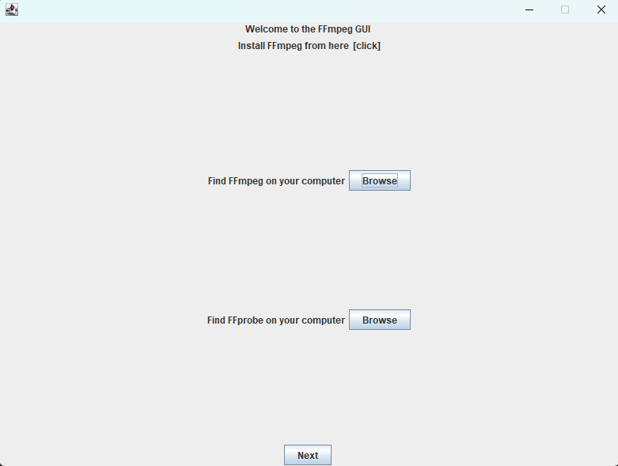
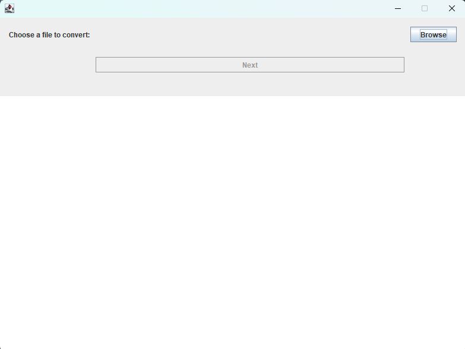
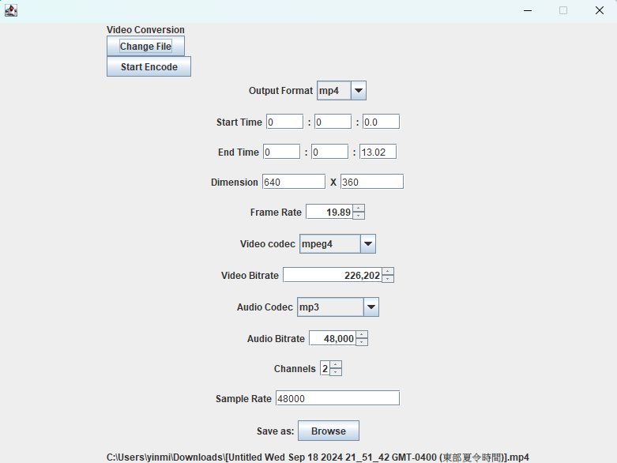

# FFmpeg For Regular People
A simple GUI for FFmpeg
## Contributors
[Amber Liu](https://github.com/ambersjliu)\
[Ming Chan](https://github.com/notming11)\
[Jack Cheng](https://github.com/21chengjk1)\
[Miranda Li](https://github.com/randyli0)
## Summary
FFmpeg For Regular People is a easy-to-use
interface for converting video and audio files. 

As indicated by the name, it uses [FFmpeg](https://ffmpeg.org/ffmpeg.html) to make media conversion possible. FFmpeg is a free and open-source software suite that can read, encode, filter, and transcode
almost every media format in use today.

This project was made possible by the [ffmpeg-cli-wrapper](https://github.com/bramp/ffmpeg-cli-wrapper) library.

### Motivation
FFmpeg comes with a powerful CLI, but many beginner users
find it difficult to understand the documentation, navigate the terminal, and learn the commands. This results
in people resorting to alternative options—often using shady websites that promise
to convert files, but frequently show obtrusive ads and malicious download links. 

Our goal with FFmpeg For Regular People was to create a tool that makes it easier
for the average person to leverage the speed and power of the FFmpeg CLI, while also offering
while offering enough flexibility to also satisfy more experienced users.

## Table of Contents
[Features](#Features)\
[Installation instructions](#installation-instructions)\
[Usage guide](#usage-guide)\
[License](#license)\
[Feedback](#feedback)\
[How to contribute](#how-to-contribute)
## Features
### Supported inputs:
- Most video/audio formats & codecs currently supported by FFmpeg ([list](https://en.wikipedia.org/wiki/FFmpeg#Supported_codecs_and_formats))
- We currently only support videos with single audio streams. We aim to support videos with multiple audio streams in the near future.
### Supported outputs:
#### Formats:
- Conversion to the following video formats:
  - mp4, mov, avi, webm, mpeg, m4v, gif
- Conversion to the following audio formats:
  - mp3, flac, alac, wav, ogg
#### Codecs:
- Encoding with the following video codecs:
  - av1, h264, hevc, mpeg1video, mpeg2video, mpeg4, vp9
- Encoding with the following audio codecs:
  - mp3, flac, opus, aac, alac, wavpack, tta, wmalossless, tak, mp4als

### Supported operations

This application supports a variety of media operations, including:
- Transcoding
- Trimming
- Resizing (video)
- Cropping (video)
- Change framerate (video)
- High-quality GIF conversion (video)

We aim to provide a minimally opinionated conversion scheme. However, certain parameter combinations
are incompatible and may not work. (For example, the "opus" audio codec supports a fixed sample rate of 48kHz.)

We hope to support more features in the future, including subtitles, chapters, and more advanced video filters.

## Installation instructions

### Dependencies
You will need Java to run this application. You can do so [here.](https://www.oracle.com/ca-en/java/technologies/downloads/)

Please follow the appropriate tutorial to add Java to your system path: [Windows and Linux](https://www.geeksforgeeks.org/how-to-set-java-path-in-windows-and-linux/), [MacOS](https://www.youtube.com/watch?v=PQk9O03cukQ)

This application also requires you to install FFmpeg.
You can do so [here](https://www.ffmpeg.org/download.html). Please keep note of the installation location. We
recommend you put it in your home directory.

Installing FFmpeg is slightly different for Mac users. Please follow this tutorial [here](https://www.youtube.com/watch?v=nmrjRqEIgGc).

### Installing the application
To install the application, download your preferred release from the [Releases](https://github.com/ambersjliu/ffmpeg-gui/releases) page.
Alternatively, you can download the source code and manually build the application.

### Running the application
To run the application, double-click the downloaded .jar file. If that doesn't work, open the command line and type  `java -jar (path to the jar file)`, replacing the last part with
the path to your jar file (no parentheses). If Java can't be found on the system, please repeat the installation process and make sure
it was added to your system path.

This application has been tested to work on 64-bit Windows and MacOS. It has not been tested on Linux yet.

## Usage guide
You are required to input the path to FFmpeg and FFprobe into the app. Most of the time, FFmpeg and FFprobe will be installed in the same directory.
Input both paths using the "Browse" button.

After entering both paths and pressing "Next", you will be able to input the file you wish to convert.
Import your file by pressing "Browse", selecting it in the dialog, and pressing "Next".

Depending on your file type, you will be sent to a different conversion view.
Fill out the form in the application, and click "Start Encode" to initialize the conversion.

You can also change your imported file by clicking the "Change File" Button. It will conveniently bring you back to the previous screen.

## License
This project is licensed under the GPL v3 license. You may view the license [here](https://github.com/ambersjliu/ffmpeg-gui/blob/main/LICENSE).

This software uses libraries from the FFmpeg project under the LGPLv2.1. We do not own FFmpeg. 
## Feedback
Please share your feedback on the [Discussions](https://github.com/ambersjliu/ffmpeg-gui/discussions) page of this repository. 
Be courteous and follow the general guidelines laid out [here](https://github.com/ambersjliu/ffmpeg-gui/discussions/40).

To suggest features or bugfixes, please open an issue on the [Issues](https://github.com/ambersjliu/ffmpeg-gui/issues) page of this repository.
All issues should have a concise title and description summarizing the problem or suggestion. Bugfix requests should include context and
detailed steps to recreate the problem. 

Issues will be addressed by the team based on feasibility (for feature suggestions) and severity (for bugfixes).

## How to contribute
Before you contribute, please take a look at the [Issues](https://github.com/ambersjliu/ffmpeg-gui/issues) page for any open issues
you can work on, especially those opened by team members. A great way to contribute is by identifying bugs and potential new features.

To contribute code, please scroll to the top of the page, click the "Fork" button by the top right, and click "Create new fork."
Once you have made a new fork, click the green "Code" button on your repository page, and clone the code using the method of your choice.
Then, create a branch with a descriptive name matching the feature to be implemented. Ensure any PRs that are opened are well-tested, well-documented,
and changes to existing code are limited to what is strictly necessary.

