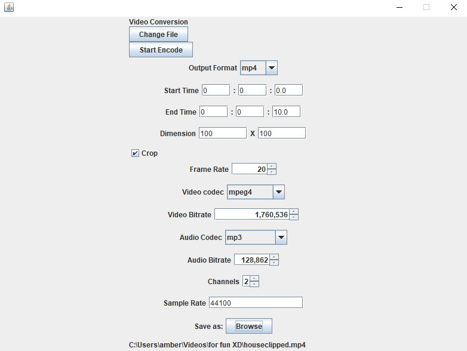

# FFmpeg For Regular People
A simple GUI for FFmpeg
## Contributors
[Amber Liu](https://github.com/ambersjliu)\
[Ming Chan](https://github.com/notming11)\
[Jack Cheng](https://github.com/21chengjk1)\
[Miranda Li](https://github.com/randyli0)
## Summary
FFmpeg For Regular People is a easy-to-use
interface for converting video and audio files. 

As indicated by the name, it uses [FFmpeg](https://ffmpeg.org/ffmpeg.html) to make media conversion possible. FFmpeg is a free and open-source software suite that can read, encode, filter, and transcode
almost every media format in use today.

This project was made possible by the [ffmpeg-cli-wrapper](https://github.com/bramp/ffmpeg-cli-wrapper) library.

### Motivation
FFmpeg comes with a powerful CLI, but many beginner users
find it difficult to understand the documentation, navigate the terminal, and learn the commands. This results
in people resorting to alternative options—often using shady websites that promise
to convert files, but frequently show obtrusive ads and malicious download links. 

Our goal with FFmpeg For Regular People was to create a tool that makes it easier
for the average person to leverage the speed and power of the FFmpeg CLI, while also offering
while offering enough flexibility to also satisfy more experienced users.

## Table of Contents
[Features](#Features)\
[Installation instructions](#installation-instructions)\
[Usage guide](#usage-guide)\
[License](#license)\
[Feedback](#feedback)\
[How to contribute](#how-to-contribute)
## Features
todo write more...
### Supported Inputs:
- Most video/audio formats & codecs currently supported by FFmpeg ([list](https://en.wikipedia.org/wiki/FFmpeg#Supported_codecs_and_formats))
- We currently only support videos with single audio streams. We aim to support videos with multiple audio streams in the near future.
### Supported Outputs:
#### Formats: 
- Conversion to the following video formats:
  - mp4, mov, avi, webm, mpeg, m4v, gif
- Conversion to the following audio formats:
  - mp3, flac, alac, wav, ogg
#### Codecs:
- Encoding with the following video codecs:
  - av1, h264, hevc, mpeg1video, mpeg2video, mpeg4, vp9
- Encoding with the following audio codecs:
  - mp3, flac, opus, aac, alac, wavpack, tta, wmalossless, tak, mp4als

We aim to provide a minimally opinionated conversion scheme. However, certain format/codec combinations
are incompatible and may not work. (For example, the "opus" audio codec supports a fixed sample rate of 48kHz.)

## Installation instructions
This application requires you to first install FFmpeg.
You can do so [here](https://www.ffmpeg.org/download.html). Please keep note of the installation location. We 
recommend you put it in your home directory.

## Usage guide
You are required to input the path to FFmpeg and FFprobe into the app. Most of the time FFmpeg and FFprobe will be in the same directory.
Input both path using the "Browse" button.

After inputing both path and pressing next, you will be able to input the file you wish to convert.
Import you file by finding in after pressing "Browse".

Depending on your file type, you will either be send to the convert audio or convert video screen. 
Fill out the specification in the app and click "Start Endoce" to initialize the conversion.

You can also change your imported file by clicking the "Change File" Button. It will conveniently bring you back to the previous screen.

## License

## Feedback

## How to contribute